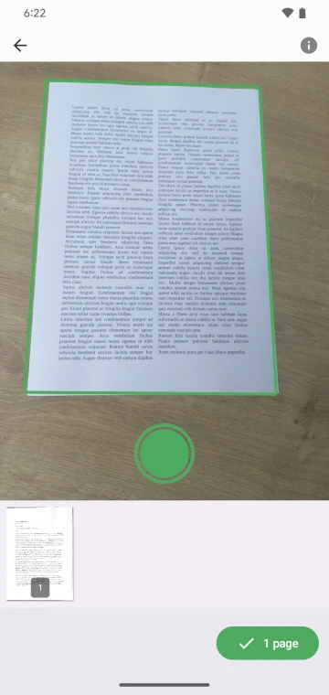
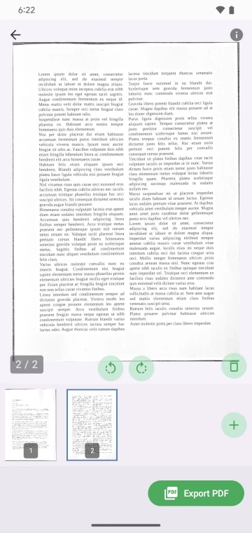
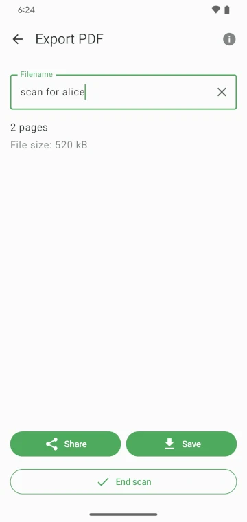

# FairScan

FairScan is an Android app to scan documents. It aims to be simple and respectful.

"Simple" means that users should get a clean PDF in seconds and without thinking:
- The user interface should be super clear, with no distraction.
- The scanning process should be obvious.
- The app should automatically handle all image processing and PDF generation tasks.

[![Google Play]][https://play.google.com/store/apps/details?id=org.fairscan.app]
[![GitHub releases]][releases]
[![fairscan.org]][https://fairscan.org]

<p>
  
  
  
</p>

## Features

- Capture from the device camera
- Automatic document detection using segmentation
- Perspective correction
- PDF export
- 100% offline, no ads, no tracking, no account

## Philosophy

Most document scanner apps are cluttered, invasive, or frustrating to use.  
FairScan aims to be a simple, efficient and respectful alternative.


## Build instructions

```bash
./gradlew assembleRelease
```

## License
This project is licensed under the GNU GPLv3. See [LICENSE](LICENSE) for details.
