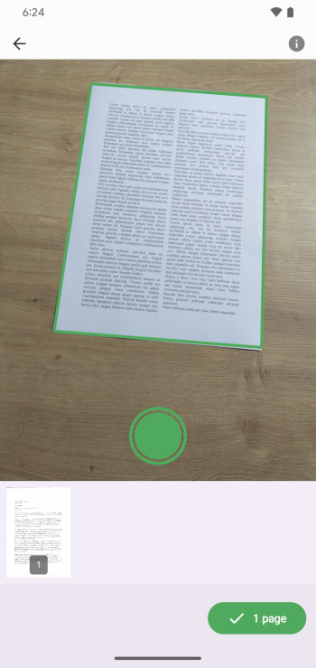
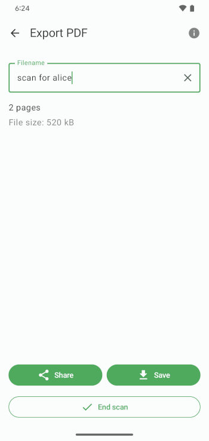

<p align="center">
  
</p>

<h1 align="center">FairScan</h1>

<p align="center">
  An Android app to scan your documents —
<br/><b>simple</b> and <b>respectful</b>.
</p>

<p align="center">
  <a href="https://github.com/pynicolas/FairScan/releases">
    
  </a>
  <a href="LICENSE">
    
  </a>
  <br><br>
  Get it on :
  <a href="https://f-droid.org/en/packages/org.fairscan.app/">
    F-Droid
  </a> | 
  <a href="https://play.google.com/store/apps/details?id=org.fairscan.app">
    Play Store
  </a> |
  <a href="https://github.com/pynicolas/FairScan/releases">
    GitHub
  </a>
</p>


---

FairScan is an Android app to **scan documents quickly, easily and privately**.

It's designed to be **simple**: users get a clean, shareable PDF in seconds, with no manual adjustments.<br>
And **respectful**: open source, minimal permissions, no tracking, no ads.

- Website: https://fairscan.org  
- Blog: https://fairscan.org/blog/

---

## Screenshots

| Scan | Preview | Save & Share |
|------|---------|--------------|
|  |  |  |

---

## Features

- **Clear interface**, easy scanning process
- **Automatic document detection** using a custom segmentation model
- **Automatic perspective correction**
- **Automatic image enhancement**
- **Fast PDF generation** with no manual adjustments
- **Fully offline** – the app has *no* internet permission
- **Minimal permissions**
- **Open source**, GPLv3

---

## Why FairScan?

Many document scanners offer dozens of options, require an account, and track users.
FairScan takes a different approach:

- single feature: scan a document to PDF
- distraction-free interface
- automatic image processing
- everything done on-device
- no accounts, no analytics, no ads

Just scan → preview → share.

---

## Compatibility

FairScan works on any device that:
- runs **Android 8.0+**
- has a camera

---

## Technical details

FairScan uses:

- [Jetpack Compose](https://developer.android.com/compose) for the UI
- [CameraX](https://developer.android.com/media/camera/camerax) for image capture
- [LiteRT](https://ai.google.dev/edge/litert) to run the custom segmentation model for automatic document detection
- [OpenCV](https://opencv.org/) for perspective correction and image enhancement
- [PDFBox-Android](https://github.com/TomRoush/PdfBox-Android) for PDF generation

---

## The segmentation model

FairScan uses a custom-trained image segmentation model to detect documents:<br>
https://github.com/pynicolas/fairscan-segmentation-model

It's based on a fully public dataset that is available here:<br>
https://github.com/pynicolas/fairscan-dataset

The build system automatically downloads the model using  
[`download-tflite.gradle.kts`](app/download-tflite.gradle.kts).

Related blog posts:
- [*Making document detection more reliable*](https://fairscan.org/blog/automatic-document-detection/)
- [*Building a public dataset for FairScan*](https://fairscan.org/blog/building_a_public_dataset/)

---

## Build

To build an APK:

```bash
./gradlew clean check assembleRelease
```
To build an Android App Bundle:
```bash
./gradlew clean check :app:bundleRelease
```

## License
This project is licensed under the GNU GPLv3. See [LICENSE](LICENSE) for details.
